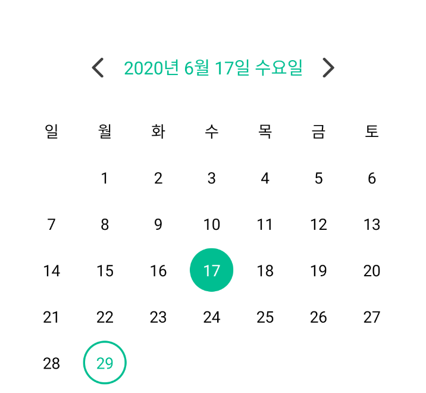
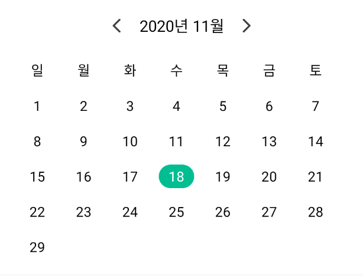
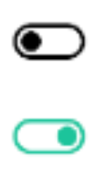

[  ](https://bintray.com/dsm-dms/DmsAndroidViewLibrary/dmsviewlibrary/0.0.5/link)
# DmsAndroidViewLibrary 
Dms에서 사용할 Android View Library 입니다.
(version 0.0.5부터 darkmode를 지원합니다.)

## Setting
build.gradle에 다음과 같이 추가해주세요.
```gradle
implementation 'com.dsm.dms.library:dmsviewlibrary:0.0.5'
implementation "androidx.swiperefreshlayout:swiperefreshlayout:1.0.0"
implementation 'com.google.android.material:material:1.2.0-alpha06'
```

## Functions
### DmsBigCalendarView


#### 
```kotlin
class MainActivity: AppCompatActivity(), DmsCalendarUserListener
```
DmsBigCalendar를 사용하는 Activity 및 Fragment에 ```DmsCalendarUserListener``` 인터페이스를 implement 해줍니다.

```kotlin
override fun selectedEvent(dateString: String) {
    // todo
}
```
인터페이스의 selectedEvent 함수를 구현해주는데 이 함수는 day가 선택될 때마다 ```yyyy년 M월 d일 E일``` 형태로 dateString이 반환됩니다.

```kotlin
override fun onCreate(savedInstanceState: Bundle?) {
    super.onCreate(savedInstanceState)
    setContentView(R.layout.main_activity)
    // essential
    calendar.setCalendar(Date(), this)

    // option
    calendar.setCalendarEventDays(
        arrayListOf(
            // event Date
        )
    )
}
```
onCreate에 Date를 설정해주고 필요한 경우 eventDays도 설정해줍니다.

## DmsSmallCalendarView


사용 방법은 DmsBigCalendarView와 동일하게 ```DmsCalendarUserListener``` 인터페이스를 implement를 하여 사용합니다.


### DmsProgressButton
(gif 화질이 낮습니다. 실제로는 훨씬 이쁘게 나와요!)

 

참고: DmsProgressButton은 Button이라고 네이밍이 되어있지만 TextView를 상속하고 있습니다.

DmsProgressButton은 총 3가지 함수를 제공합니다.

* onLoad(loadMessage: String)
    ```kotlin 
    button.setOnClickListener {
        button.onLoad("로딩")
    }
    ```
    onLoad 함수를 호출하면 다음과 같이 Message와 함께 Circle Progress가 돌아가는 뷰을 보여줍니다.
    
    

    progress의 모양을 변경하고 싶으시다면 ```progressDrawable``` 변수에 접근해서 사이즈 및 스타일을 변경할 수 있습니다.

* onError(errorMessage: String)
    ```kotlin 
    button.setOnClickListener {
        button.onError("에러")
    }
    ```
    onError 함수를 호출하면 다음과 같이 색상이 붉은 색으로 변하고 errorMessage를 보여줍니다.

    

    에러 시 발생하는 붉은 색상을 다른 색상으로 변경하고 싶으시다면 ```errorColor``` 변수에 접근해서 색상을 변경할 수 있습니다.

* onSuccess(successMessage: String)
    ```kotlin 
    button.setOnClickListener {
        button.onSuccess("성공")
    }
    ```
    onSuccess 함수를 호출하면 다음과 같이 check mark와 함께 successMessage를 보여줍니다.

    

    check mark가 아닌 다른 icon animation을 보여주고 싶으시거나 모양을 변경하고 싶으시다면 ```animatedDrawable ``` 변수에 접근하셔서 애니메이션, 사이즈 및 스타일을 변경할 수 있습니다.

    또, isComeback 이라는 boolean 값을 조정하여 원래 상태로 돌아올 것인지 아닌지에 대해 설정할 수 있습니다.

### DmsProgressMaterialButton
DmsProgressButton과 동일한 기능을 가지고 있습니다.

### DmsSettingSwitch
Dms에서 활용하는 디자인의 Switch입니다.


